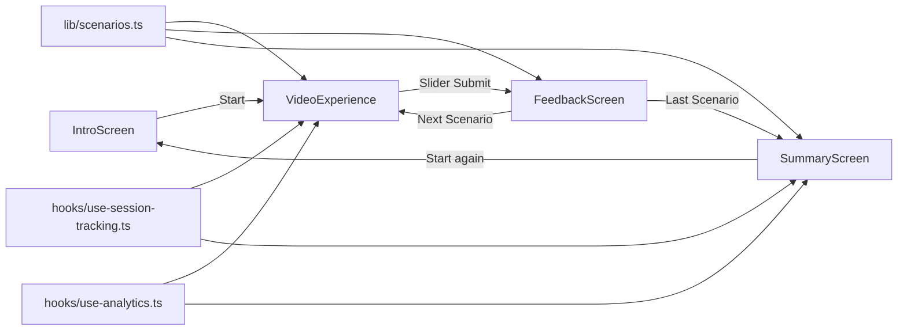

# TrustCheck - Deepfake Detection Experience


Interactive, web app for PSUIs (Public Security User Interfaces): users rate the trustworthiness of deepfake and real videos and receive immediate, educational feedback on deepfakes and misinformation.

## 1. Project 
This project has been created for the Usable Security Master Practical @Ludwig-Maximilians-University (LMU).
### Core Features

- Guided multi-screen flow: Intro -> Video Rating -> Feedback -> Summary.
- TikTok-inspired video experience with comments, reactions, and a trust slider.
- 5 predefined scenarios (fake + authentic) including explanations, cues, and real-world actions.
- Immediate per-decision feedback (correct/incorrect) with a security checklist.
- Results view with an accuracy ring, clip review carousel, and practical takeaways.
- Session tracking for public displays, including automatic timeout reset.
- Event tracking via Vercel Analytics
- Visually polished,kiosk UI with Tailwind v4 design tokens and animations.

## 2. Tech Stack & Libraries

| Technology / Library | Responsibility in Project |
| --- | --- |
| Next.js 16 (App Router) | Core framework, routing, build pipeline, SSR infrastructure |
| React 19 + TypeScript | Component architecture, state management, type safety |
| Tailwind CSS v4 + PostCSS | Utility-first styling, theme tokens, responsive layouts |
| shadcn/ui | Reusable UI building blocks built on Radix primitives |
| Radix UI | Accessibility-focused primitives (dialogs, sliders, tabs, and more) |
| Lucide React | Consistent icon system for UI and feedback communication |
| Vercel Analytics | Production event tracking and usage insights |

## 3. Architecture / How It Works

The application follows a state-driven single-flow architecture. In [app/page.tsx](app/page.tsx), a `currentScreen` state orchestrates the full user experience.



### Data Flow at a Glance

1. Scenario data is centrally defined in [lib/scenarios.ts](lib/scenarios.ts).
2. In [components/video-experience.tsx](components/video-experience.tsx), users rate trustworthiness via slider.
3. In [components/feedback-screen.tsx](components/feedback-screen.tsx), input is evaluated against `recommendedTrust`.
4. Results are aggregated in [app/page.tsx](app/page.tsx) and visualized in [components/summary-screen.tsx](components/summary-screen.tsx).
5. Session and analytics hooks capture activity and events throughout the complete flow.

> Note: The app is optimized for public-display/kiosk usage, touch interaction, and a clear linear journey so it may look weird on other displays.

## 4. Requirements & Installation

### Prerequisites

- Node.js (recommended: current LTS, at least compatible with Next.js 16)
- pnpm 8+
- Modern browser (Chrome, Edge, Safari) for video playback and touch interaction

### Installation (Step by Step)

1. Clone the repository

```bash
git clone <repository-url>
cd deepfake-detection-app
```

2. Install dependencies

```bash
pnpm install
```


3. Start the development server

```bash
pnpm dev
```

4. Open the app in your browser

```text
http://localhost:3000
```

> Critical note: Analytics mounting in [app/layout.tsx](app/layout.tsx#L55) is only enabled in `production`. Local runs therefore do not show Vercel Analytics events in production dashboards by default.
>
> Critical note: In [hooks/use-session-tracking.ts](hooks/use-session-tracking.ts#L4), timeout is currently set to 60 seconds (`SESSION_TIMEOUT_MS = 60 * 1000`) 

## 5. Usage

### Development

```bash
pnpm dev
```

### Linting

```bash
pnpm lint
```

### Production Build + Start

```bash
pnpm build
pnpm start
```

### Enable Analytics/Session Debug in Browser

```js
// Run in browser console
localStorage.setItem('DEBUG_ANALYTICS', 'true')
localStorage.setItem('DEBUG_SESSION', 'true')
location.reload()
```

### Project Structure (Key Areas)

```text
app/
   layout.tsx              # Root layout + Analytics mounting in production
   page.tsx                # Main state and screen orchestration
components/
   intro-screen.tsx        # Entry screen
   video-experience.tsx    # Video interaction + slider + social mockup
   feedback-screen.tsx     # Correctness + educational feedback
   summary-screen.tsx      # Accuracy + review + takeaways
   ui/                     # shadcn/Radix-based UI components
hooks/
   use-session-tracking.ts # Session ID + timeout behavior
   use-analytics.ts        # Event tracking wrapper
lib/
   scenarios.ts            # Scenario data + evaluation logic
```


### License

This project is licensed under the MIT License.